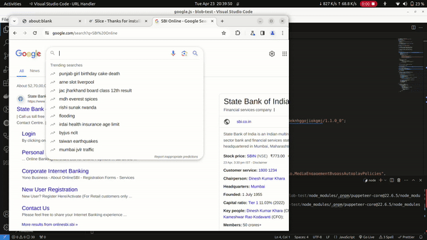

# Slice Chrome Extension Automation

This project automates the viewing of advertisements through the Slice Chrome Extension. It is designed to view ads on your behalf, and credits for viewing these ads will be automatically added to your Slice account. You can monitor these credits through the Slice extension app.

**Note: This project is intended for educational purposes and fun only.**

## Demo




## Getting Started

These instructions will guide you through setting up and running the project on your local machine for both development and testing purposes.

### Prerequisites

Ensure you have Node.js installed on your system before proceeding. Download it from [Node.js official website](https://nodejs.org/). This project utilizes `pnpm` for dependency management.

### Installing

To set up your development environment, follow these steps:

1. **Clone the repository**

    ```sh
    git clone https://github.com/shiv-source/slice-chrome-extension-automation.git
    cd slice-chrome-extension-automation
    ```

2. **Install required dependencies**

    ```sh
    pnpm install
    ```

3. **Configuration**

    Modify the `.env` file with your specific values:

    ```env
    SLICE_EXTENSION_PATH=YOUR SLICE EXTENSION PATH
    TOTAL_DURATION=60 
    USER_AGENT=YOUR_USER_AGENT
    ```

    - `SLICE_EXTENSION_PATH`: Path to your local Slice Chrome Extension.
    - `TOTAL_DURATION`: The total duration (in seconds) the script will run.
    - `USER_AGENT`: User agent string for the browser instance.

### Running the script

Execute the automation script with the following command:

```sh
pnpm start
```

## Note

- `TOTAL_DURATION` indicates the script's execution time in seconds. Adjust as necessary depending on how long you want the automation to run.
- Verify the accuracy of `.env` values to prevent runtime errors.

## Contributing

Contributions are welcome! Feel free to fork the repository, submit pull requests, or open issues to suggest improvements or report bugs.

## License

This project is licensed under the MIT License - see the [LICENSE](LICENSE) file for details.

## Acknowledgments

- Thanks to all contributors and users of this project.
- A special thanks to the Puppeteer community for their support and resources.
